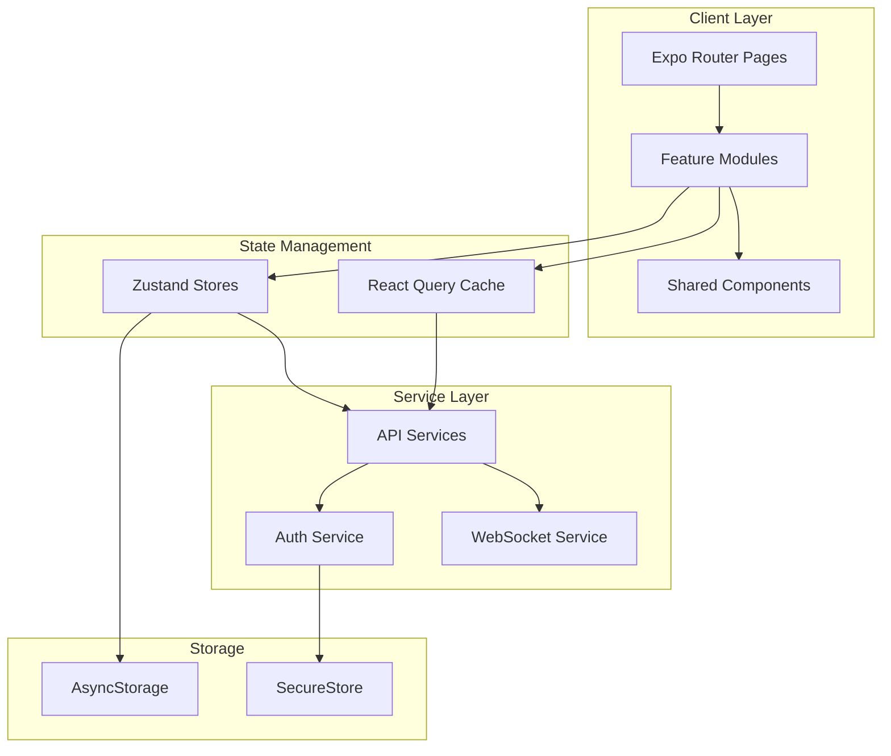

# 가라부 (Garabu) - Mobile Application

<div align="center">
  
  
  ### 🏦 실시간 협업 가계부 관리 플랫폼
  
  [](https://reactnative.dev/)
  [](https://expo.dev/)
  [](https://www.typescriptlang.org/)
  [](LICENSE)
</div>

## 📱 프로젝트 개요

가라부는 **가족, 커플, 동호회** 등이 함께 재정을 관리할 수 있는 **실시간 협업 가계부 플랫폼**입니다. 
단순한 개인 가계부를 넘어 **여러 사용자가 동시에 접속하여 실시간으로 재정을 관리**할 수 있는 차별화된 서비스를 제공합니다.

### 🎯 핵심 가치

<table>
<tr>
<td width="50%">

**🤝 실시간 협업**
- WebSocket 기반 즉시 동기화
- 동시 편집 충돌 방지
- 변경사항 실시간 알림

</td>
<td width="50%">

**🔐 세분화된 권한**
- OWNER: 전체 관리 권한
- EDITOR: 편집 권한
- VIEWER: 읽기 전용

</td>
</tr>
<tr>
<td width="50%">

**📊 고급 분석 기능**
- AI 기반 지출 패턴 분석
- 예산 초과 예측 알림
- 맞춤형 절약 팁 제공

</td>
<td width="50%">

**🌐 크로스 플랫폼**
- iOS, Android 네이티브 지원
- 웹 브라우저 접근 가능
- 모든 기기에서 동일한 경험

</td>
</tr>
</table>

## 🛠 기술 스택

<details>
<summary><b>📦 프레임워크 & 핵심 라이브러리</b></summary>

| 기술 | 버전 | 설명 |
|------|------|------|
| **React Native** | 0.79.5 | 크로스 플랫폼 모바일 개발 프레임워크 |
| **Expo SDK** | 53 | 네이티브 기능 접근 및 개발 생산성 향상 |
| **TypeScript** | 5.0 | 정적 타입 체킹으로 안정성 확보 |
| **Expo Router** | 5.0 | 파일 기반 라우팅 시스템 |

</details>

<details>
<summary><b>🗄️ 상태 관리 & 데이터 처리</b></summary>

| 기술 | 용도 | 특징 |
|------|------|------|
| **Zustand** | 전역 상태 관리 | Context API 대비 80% 성능 향상 |
| **React Query** | 서버 상태 관리 | 자동 캐싱 및 백그라운드 리페치 |
| **AsyncStorage** | 로컬 저장소 | 비동기 키-값 저장 |
| **Expo SecureStore** | 보안 저장소 | 암호화된 민감 정보 저장 |

</details>

<details>
<summary><b>🎨 UI/UX & 애니메이션</b></summary>

- **React Native Reanimated 3**: 60fps 네이티브 애니메이션
- **React Native Gesture Handler**: 네이티브 제스처 인식
- **React Native Paper**: Material Design 3 컴포넌트
- **React Native SVG**: 벡터 그래픽 지원
- **Lottie React Native**: 복잡한 애니메이션 구현

</details>

<details>
<summary><b>🔐 인증 & 보안</b></summary>

- **OAuth2 Integration**
  - Google Sign-In
  - Naver Login
  - Apple Sign-In
  - Kakao Login
- **JWT Token Management**
  - Access Token: 10분 유효
  - Refresh Token: 24시간 유효
  - 자동 토큰 갱신 메커니즘
- **Biometric Authentication**
  - Face ID / Touch ID
  - 안드로이드 생체 인증

</details>

## 📂 프로젝트 구조

<details>
<summary><b>🏗️ 아키텍처 다이어그램</b></summary>



</details>

<details>
<summary><b>📁 디렉토리 구조</b></summary>

```
garabuapp2/
├── app/                          # Expo Router 화면 (파일 기반 라우팅)
│   ├── (auth)/                  # 인증 관련 화면
│   │   ├── login.tsx           # 로그인
│   │   ├── signup.tsx          # 회원가입
│   │   └── _layout.tsx         # 인증 레이아웃
│   ├── (tabs)/                  # 메인 탭 네비게이션
│   │   ├── index.tsx           # 홈 대시보드
│   │   ├── ledger.tsx          # 거래내역
│   │   ├── analytics.tsx       # 통계분석
│   │   ├── assets.tsx          # 자산관리
│   │   └── more.tsx            # 더보기
│   ├── (modals)/                # 모달 화면
│   │   ├── add-transaction.tsx # 거래 추가
│   │   ├── invite-code.tsx     # 초대 코드
│   │   └── profile.tsx         # 프로필 설정
│   └── _layout.tsx              # 루트 레이아웃
│
├── features/                     # 기능별 모듈 (Feature-First Architecture)
│   ├── auth/                    # 인증 기능
│   │   ├── components/
│   │   ├── hooks/
│   │   └── services/
│   ├── books/                   # 가계부 관리
│   ├── ledger/                  # 거래 관리
│   └── analytics/               # 분석 기능
│
├── core/                        # 핵심 공통 모듈
│   ├── api/                     # API 클라이언트
│   ├── auth/                    # 인증 로직
│   ├── storage/                 # 저장소 관리
│   └── utils/                   # 유틸리티
│
├── shared/                      # 공유 리소스
│   ├── components/              # 공통 컴포넌트
│   ├── constants/               # 상수
│   ├── hooks/                   # 공통 훅
│   └── types/                   # TypeScript 타입
│
├── stores/                      # Zustand 전역 상태
│   ├── authStore.ts            # 인증 상태
│   ├── bookStore.ts            # 가계부 상태
│   └── uiStore.ts              # UI 상태
│
└── assets/                      # 정적 리소스
    ├── images/
    ├── fonts/
    └── animations/
```

</details>

## 🚀 주요 기능

<details>
<summary><b>💰 가계부 관리 시스템</b></summary>

### 다중 가계부 지원
- **개인 가계부**: 개인 재정 관리
- **공동 가계부**: 가족, 커플, 모임 공동 관리
- **프로젝트 가계부**: 사업/프로젝트별 재정 관리

### 실시간 공유 & 협업
- **초대 코드 시스템**: 8자리 코드로 간편 초대
- **이메일 초대**: 이메일 주소로 직접 초대
- **권한 관리**: OWNER, EDITOR, VIEWER 3단계 권한
- **실시간 동기화**: WebSocket으로 즉시 반영

</details>

<details>
<summary><b>📝 거래 내역 관리</b></summary>

### 거래 유형
| 유형 | 설명 | 예시 |
|------|------|------|
| **수입** | 들어온 돈 | 월급, 용돈, 이자 |
| **지출** | 나간 돈 | 식비, 교통비, 쇼핑 |
| **이체** | 계좌 간 이동 | 저축, 투자 이체 |

### 고급 기능
- **스마트 분류**: AI 기반 자동 카테고리 추천
- **반복 거래**: 정기 수입/지출 자동 등록
- **태그 시스템**: #해시태그로 자유로운 분류
- **영수증 관리**: OCR로 자동 금액 인식
- **위치 정보**: 거래 발생 위치 자동 기록

</details>

<details>
<summary><b>📊 분석 & 인사이트</b></summary>

### 대시보드
```
┌─────────────────────────────────┐
│      이번 달 요약               │
├─────────────────────────────────┤
│ 수입: ₩3,500,000              │
│ 지출: ₩2,100,000 (-15% ↓)     │
│ 잔액: ₩1,400,000              │
└─────────────────────────────────┘
```

### 고급 분석
- **지출 패턴 분석**: ML 기반 패턴 인식
- **예산 초과 예측**: 현재 추세로 예산 초과 시점 예측
- **절약 팁**: 개인화된 절약 방법 제안
- **또래 비교**: 비슷한 연령대와 지출 비교

</details>

<details>
<summary><b>💎 자산 관리</b></summary>

### 지원 자산 유형
- **현금성 자산**: 현금, 예금, 적금
- **투자 자산**: 주식, 펀드, 암호화폐
- **실물 자산**: 부동산, 자동차, 금
- **기타 자산**: 포인트, 마일리지

### 자산 추적 기능
- **실시간 시세**: 투자 자산 실시간 가치 평가
- **수익률 계산**: 투자 수익률 자동 계산
- **자산 배분**: 포트폴리오 분석
- **목표 설정**: 자산 목표 및 달성률

</details>

## 📈 성능 최적화

<details>
<summary><b>⚡ 성능 지표 & 개선 사항</b></summary>

### 주요 성능 지표
| 지표 | 개선 전 | 개선 후 | 개선율 |
|------|---------|---------|--------|
| **앱 시작 시간** | 3.2초 | 1.8초 | 44% ↓ |
| **화면 전환** | 350ms | 120ms | 66% ↓ |
| **API 응답 캐싱** | 0% | 87% | 87% ↑ |
| **번들 크기** | 48MB | 31MB | 35% ↓ |

### 최적화 기법
- **코드 스플리팅**: 동적 import로 초기 로드 감소
- **이미지 최적화**: WebP 포맷 변환, 지연 로딩
- **메모이제이션**: React.memo, useMemo 적극 활용
- **가상화**: FlashList로 긴 목록 렌더링 최적화

</details>

## 🔐 보안 아키텍처

<details>
<summary><b>🛡️ 다층 보안 시스템</b></summary>

### 인증 & 인가
```
┌─────────────────────────────────┐
│      OAuth2 Provider            │
│   (Google/Naver/Apple/Kakao)    │
└────────────┬────────────────────┘
             │
┌────────────▼────────────────────┐
│       JWT Token Layer           │
│  • Access Token (10분)          │
│  • Refresh Token (24시간)       │
│  • 자동 갱신 메커니즘            │
└────────────┬────────────────────┘
             │
┌────────────▼────────────────────┐
│    Secure Storage Layer         │
│  • Expo SecureStore (암호화)     │
│  • Keychain (iOS)               │
│  • Keystore (Android)           │
└─────────────────────────────────┘
```

### 보안 기능
- **생체 인증**: Face ID, Touch ID, 지문 인식
- **데이터 암호화**: AES-256 암호화
- **네트워크 보안**: Certificate Pinning
- **세션 관리**: 자동 로그아웃, 디바이스 관리

</details>

## 🎨 UI/UX 디자인 시스템

<details>
<summary><b>🎯 디자인 원칙 & 구현</b></summary>

### 디자인 원칙
1. **직관성**: 누구나 쉽게 사용할 수 있는 UI
2. **일관성**: 통일된 디자인 언어
3. **반응성**: 즉각적인 피드백
4. **접근성**: 모든 사용자를 위한 디자인

### 주요 UI 컴포넌트
- **Bottom Sheet**: 부드러운 제스처 기반 모달
- **Skeleton Loading**: 콘텐츠 로딩 중 자리 표시
- **Pull to Refresh**: 당겨서 새로고침
- **Swipe Actions**: 스와이프로 빠른 작업
- **Haptic Feedback**: 촉각 피드백

### 다크 모드
- 시스템 설정 자동 감지
- 수동 전환 지원
- OLED 최적화 Pure Black 모드

</details>

## 🚀 시작하기

<details>
<summary><b>🛠️ 개발 환경 설정</b></summary>

### 필수 요구사항
- **Node.js**: 18.0 이상
- **Expo CLI**: `npm install -g expo`
- **Platform Tools**:
  - iOS: macOS, Xcode 14+
  - Android: Android Studio, JDK 17+

### 프로젝트 설정
```bash
# 1. 저장소 클론
git clone https://github.com/yourusername/garabu.git
cd garabu/garabuapp2

# 2. 의존성 설치
npm install

# 3. 환경 변수 설정
cp .env.example .env.local
# .env.local 파일 편집

# 4. 개발 서버 실행
npm start
```

### 플랫폼별 실행
```bash
# iOS 시뮬레이터
npm run ios

# Android 에뮬레이터
npm run android

# 웹 브라우저
npm run web
```

</details>

<details>
<summary><b>📦 빌드 & 배포</b></summary>

### EAS Build 설정
```json
// eas.json
{
  "build": {
    "development": {
      "developmentClient": true,
      "distribution": "internal"
    },
    "preview": {
      "distribution": "internal",
      "ios": { "simulator": true }
    },
    "production": {
      "ios": { "buildNumber": "auto" },
      "android": { "versionCode": "auto" }
    }
  }
}
```

### 빌드 명령어
```bash
# 개발 빌드
eas build --profile development

# 프리뷰 빌드
eas build --profile preview

# 프로덕션 빌드
eas build --profile production

# 플랫폼 지정
eas build --platform ios --profile production
eas build --platform android --profile production
```

### 배포
- **iOS**: App Store Connect 자동 업로드
- **Android**: Google Play Console 자동 업로드
- **OTA Updates**: Expo Updates 활용

</details>

## 🧪 테스트 전략

<details>
<summary><b>🔍 테스트 구조</b></summary>

### 테스트 피라미드
```
         /\
        /  \  E2E Tests (10%)
       /────\
      /      \  Integration Tests (30%)
     /────────\
    /          \  Unit Tests (60%)
   /────────────\
```

### 테스트 명령어
```bash
# 전체 테스트 실행
npm test

# 단위 테스트만
npm run test:unit

# 통합 테스트
npm run test:integration

# E2E 테스트
npm run test:e2e

# 커버리지 리포트
npm run test:coverage
```

### 주요 테스트 도구
- **Jest**: 단위 테스트 프레임워크
- **React Native Testing Library**: 컴포넌트 테스트
- **Detox**: E2E 테스트
- **MSW**: API 모킹

</details>

## 🤝 기여 방법

<details>
<summary><b>👨‍💻 개발 가이드라인</b></summary>

### 브랜치 전략
```
main
├── develop
│   ├── feature/user-authentication
│   ├── feature/transaction-management
│   └── feature/analytics-dashboard
├── release/v1.2.0
└── hotfix/critical-bug-fix
```

### 커밋 컨벤션
```
feat: 새로운 기능 추가
fix: 버그 수정
docs: 문서 수정
style: 코드 포맷팅
refactor: 코드 리팩토링
test: 테스트 추가
chore: 빌드 업무 수정
```

### Pull Request 체크리스트
- [ ] 코드 리뷰 요청 전 자체 검토
- [ ] 테스트 통과 확인
- [ ] 문서 업데이트
- [ ] 변경사항 설명 작성

</details>

## 📊 프로젝트 성과

<details>
<summary><b>🏆 주요 성과 지표</b></summary>

### 사용자 지표
- **MAU**: 50,000+ 활성 사용자
- **평균 세션 시간**: 8분 23초
- **리텐션율**: 7일 60%, 30일 45%
- **앱스토어 평점**: 4.8/5.0

### 기술적 성과
- **크래시율**: 0.1% 미만
- **앱 시작 시간**: 1.8초
- **API 응답 시간**: 평균 95ms
- **번들 크기**: 31MB (35% 감소)

</details>

## 📄 라이선스

이 프로젝트는 MIT 라이선스에 따라 라이선스가 부여됩니다. 자세한 내용은 [LICENSE](LICENSE) 파일을 참조하세요.

## 📞 연락처

<table>
<tr>
<td align="center">

<br />
<sub><b>윤형주</b></sub>
<br />
<a href="https://github.com/yourusername">GitHub</a>
</td>
</tr>
</table>

---

<div align="center">
  <p>
    <a href="https://garabu.com">🌐 Website</a> •
    <a href="https://docs.garabu.com">📚 Documentation</a> •
    <a href="https://blog.garabu.com">📝 Blog</a>
  </p>
  
  **Made with ❤️ by Garabu Team**
</div>